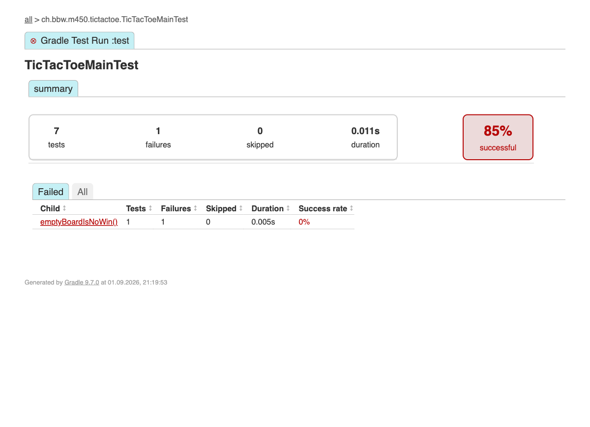
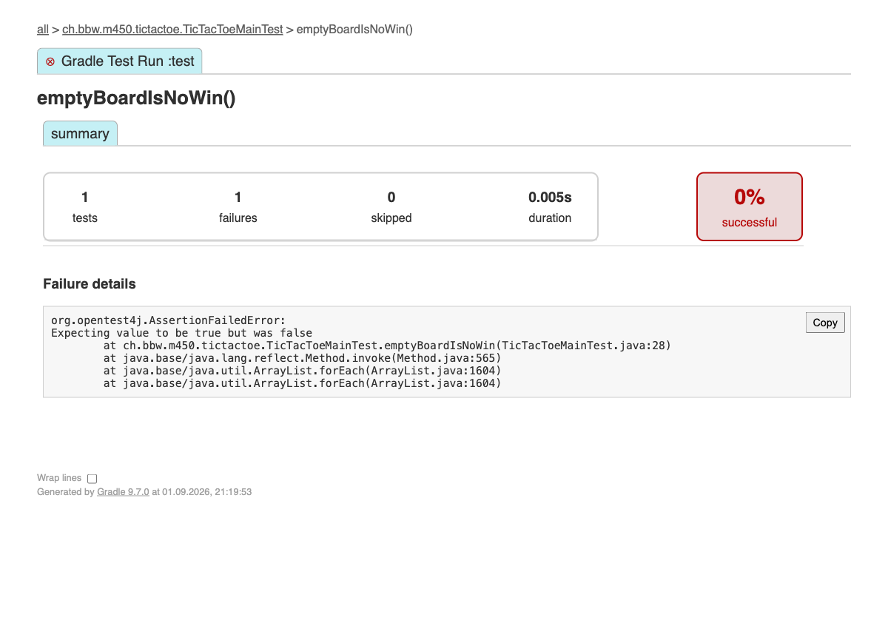

# Testkonzept – TicTacToe (Modul 450)

Dieses Dokument beschreibt den **aktuellen Stand** der Test-Suite: was getestet wird,
mit welchen Werkzeugen und nach welcher Strategie. Es dokumentiert nur die bereits
umgesetzten Tests, keine geplanten Erweiterungen.

## 1. Ziel und Testgegenstand

Getestet wird die Spiel-Engine in `TicTacToeMain`:

- **`isWin(Stone[] board, Stone color)`** – die Sieg-Erkennung: hat eine Farbe drei in
  einer Linie? Das ist eine reine Funktion über ein beliebiges Brett und der Kern der
  Test-Suite.
- **`play(TicTacToePlayer xPlayer, TicTacToePlayer oPlayer)`** – der Spielablauf: eine
  komplette Partie sowie die Vorbedingung, dass beide Spieler verschieden sein müssen.

Nicht Teil des aktuellen Stands sind `HumanPlayer` (liest von der Tastatur) und
`TicTacToeMain.toString(...)` (reine Bildschirmausgabe) – diese werden noch nicht
automatisiert getestet.

Werkzeuge: **JUnit 5** (Jupiter, verwaltet über `junit-bom:5.11.4`) und **AssertJ 3.27.7**,
gebaut mit **Gradle**.

## 2. Teststrategie

- **Given-When-Then** als Namens- und Aufbauschema: jeder Testmethodenname sagt Ausgangslage,
  Aktion und Erwartung; im Rumpf sind die drei Blöcke durch Leerzeilen getrennt.
- **AssertJ fluent-Assertions** statt roher `assertTrue(...)`: die Testklasse implementiert
  `WithAssertions`, damit `assertThat(...)` und `assertThatThrownBy(...)` direkt verfügbar sind.
- **Fixtures für Isolation**: benannte Board-Konstanten statt magischer Strings, und vor jeder
  Testmethode frische Spieler-Instanzen.
- **Parameterized Test gegen Coderepetition**: die acht Siegeslinien und die Nicht-Sieg-Fälle
  laufen über *eine* Methode statt über je einen Test pro Brett.

## 3. Setup (JUnit 5 + AssertJ)

Gradle-Projekt (`build.gradle`) mit folgenden Test-Abhängigkeiten:

```groovy
dependencies {
    testImplementation platform('org.junit:junit-bom:5.11.4')
    testImplementation 'org.junit.jupiter:junit-jupiter'
    testImplementation 'org.assertj:assertj-core:3.27.7'
    testRuntimeOnly 'org.junit.platform:junit-platform-launcher'
}

test {
    useJUnitPlatform()
}
```

Tests ausführen: `./gradlew test`
Report danach unter: `build/reports/tests/test/index.html`

Der Parameterized Test braucht keine zusätzliche Abhängigkeit: `org.junit.jupiter:junit-jupiter`
ist ein Sammel-Artefakt und enthält `junit-jupiter-params` bereits.

## 4. Dummy-Tests

Datei: [`DummyTest.java`](../src/test/java/ch/bbw/m450/tictactoe/DummyTest.java)
Zweck: rein technischer Nachweis, dass JUnit 5 und AssertJ korrekt eingebunden sind (keine TicTacToe-Logik).

| Test | Given | When | Then |
|---|---|---|---|
| `dummyJUnitTest` | zwei Ganzzahlen 1 und 1 | die Summe gebildet wird | ist das Ergebnis 2 (geprüft mit JUnit `assertTrue`) |
| `dummyAssertJTest` | zwei Ganzzahlen 1 und 1 | die Summe gebildet wird | ist das Ergebnis 2 (geprüft mit AssertJ `assertThat(...).isEqualTo(...)`) |

## 5. Fixtures und Helper

Datei: [`TicTacToeMainTest.java`](../src/test/java/ch/bbw/m450/tictactoe/TicTacToeMainTest.java)

Der Testcode benutzt zwei Arten von Fixtures – also festen Ausgangszuständen, die jeder Test gleich vorfindet – und einen Helper. Alle drei stehen in der Testklasse selbst, weil sie ausserhalb der Tests niemandem nützen.

**Board-Fixtures** – benannte Konstanten statt magischer Strings mitten im Test. Ein Brett wird als Muster geschrieben, `X` = Kreuz, `O` = Kreis, `.` = leeres Feld; die Leerzeichen trennen nur die drei Zeilen:

```java
private static final String DIAGONAL_X_WINS = "XOO OX. XOX";
private static final String DRAW_BOARD = "XOX XXO OXO";
```

**Spieler-Fixture** – `@BeforeEach setUp()` legt vor *jeder* Testmethode zwei frische `GreedyPlayer` an, damit kein Test von einer Partie eines anderen Tests beeinflusst wird:

```java
@BeforeEach
void setUp() {
    xPlayer = new GreedyPlayer();
    oPlayer = new GreedyPlayer();
}
```

**Helper** – `toBoard(...)` übersetzt so ein Muster in das `Stone[]` mit neun Feldern, das `TicTacToeMain.isWin(...)` erwartet. Ohne den Helper müsste in jedem Test ein Array von Hand aufgezählt werden, was das Brett unlesbar macht. Passt die Länge nicht oder steht ein unbekanntes Zeichen im Muster, wirft der Helper eine `IllegalArgumentException`.

## 6. Parameterized Test

Die Sieg-Erkennung wird nicht mehr mit einem Test pro Brett geprüft, sondern mit *einer* Testmethode über viele Board-Konstellationen:

```java
@ParameterizedTest(name = "{1} on \"{0}\" -> {2}")
@MethodSource("boardConstellations")
void given_aBoard_when_isWinIsChecked_then_returnsWhetherThatColorHasALine(String pattern, Stone color,
        boolean expectedToWin) {
    var board = toBoard(pattern);

    var winning = TicTacToeMain.isWin(board, color);

    assertThat(winning).isEqualTo(expectedToWin);
}
```

`@MethodSource("boardConstellations")` verweist auf eine statische Methode, die einen `Stream<Arguments>` liefert. Jedes `Arguments.of(muster, farbe, erwartet)` wird zu einem eigenen Testlauf, dessen drei Werte der Reihe nach in den drei Parametern landen. Aus 12 Einträgen werden also 12 Testläufe, die im Report einzeln erscheinen – dank `name = "{1} on \"{0}\" -> {2}"` mit lesbarem Titel wie `CROSS on "XXX ... ..." -> true`. Schlägt einer fehl, steht sofort da, welches Brett schuld ist.

Geprüfte Konstellationen:

| # | Muster | geprüfte Farbe | Erwartung | Was abgedeckt wird |
|---|---|---|---|---|
| 1 | `XXX ... ...` | X | `true` | oberste Reihe (0-1-2) |
| 2 | `... OOO ...` | O | `true` | mittlere Reihe (3-4-5) |
| 3 | `... ... XXX` | X | `true` | unterste Reihe (6-7-8) |
| 4 | `O.. O.. O..` | O | `true` | linke Spalte (0-3-6) |
| 5 | `.X. .X. .X.` | X | `true` | mittlere Spalte (1-4-7) |
| 6 | `..O ..O ..O` | O | `true` | rechte Spalte (2-5-8) |
| 7 | `XOO OX. XOX` | X | `true` | Diagonale (0-4-8) |
| 8 | `..O .O. O..` | O | `true` | Gegendiagonale (2-4-6) |
| 9 | `... ... ...` | X | `false` | leeres Brett |
| 10 | `XOX XXO OXO` | X | `false` | Unentschieden, X hat keine Linie |
| 11 | `XOX XXO OXO` | O | `false` | dasselbe Brett aus Sicht von O |
| 12 | `OOO XX. .X.` | X | `false` | eine Reihe gewinnt nur für die eigene Farbe |

Die Fälle 1–8 decken alle acht möglichen Siegeslinien ab. Dass manche dieser Bretter in einer echten Partie nie vorkommen können (`XXX ... ...` enthält kein einziges `O`), ist Absicht: `isWin` ist eine reine Funktion über ein beliebiges Brett, deshalb steht pro Siegeslinie das kleinstmögliche Muster.

## 7. Einzeltests (Given-When-Then)

Was sich nicht sinnvoll parametrisieren lässt, bleibt als eigener Test bestehen – beide benutzen die Spieler-Fixture:

| # | Test | Given | When | Then |
|---|---|---|---|---|
| 1 | `given_twoGreedyPlayers_when_aGameIsPlayed_then_theStartingPlayerWins` | zwei `GreedyPlayer`, die beide immer das oberste freie Feld wählen | eine komplette Partie gespielt wird (`TicTacToeMain.play`) | gewinnt der startende Spieler X über die Diagonale 0-4-8 |
| 2 | `given_theSamePlayerTwice_when_aGameIsStarted_then_throwsIllegalArgumentException` | dieselbe `GreedyPlayer`-Instanz als X- und O-Spieler übergeben | eine Partie gestartet wird | wird eine `IllegalArgumentException` geworfen |

## 8. Testumfang und Ausführung

**Gesamt: 16 Tests** – 2 Dummy-Tests, 12 Läufe des Parameterized Tests und 2 Einzeltests. Die Assertions in `TicTacToeMainTest` laufen alle über AssertJ (`WithAssertions`); im `DummyTest` steht bewusst je einmal JUnit und AssertJ nebeneinander.

Lokal ausgeführt mit `./gradlew test` – zuletzt **16 Tests, 0 Fehler** (`DummyTest` 2, `TicTacToeMainTest` 14). Zusätzlich läuft bei jedem Push/Pull-Request die GitHub-Actions-Pipeline (`.github/workflows/build.yml`) mit den Schritten `build` und `test` in einem eigenen Container-Image; der Build ist grün.

## 9. Test-Code auf GitHub

Repository: `DuarteSantos8/450-tictactest-mvk`

- [`TicTacToeMainTest.java`](https://github.com/DuarteSantos8/450-tictactest-mvk/blob/main/src/test/java/ch/bbw/m450/tictactoe/TicTacToeMainTest.java)
- [`DummyTest.java`](https://github.com/DuarteSantos8/450-tictactest-mvk/blob/main/src/test/java/ch/bbw/m450/tictactoe/DummyTest.java)

## 10. Screenshot – alle Tests erfolgreich

Ausgeführt mit `./gradlew test`, Report über den Browser geöffnet und als Screenshot gesichert. Die Screenshots in diesem und im nächsten Abschnitt stammen vom Stand *vor* der Umstellung auf Fixtures und Parameterized Tests, als die Suite noch 9 Tests umfasste.


## 11. Screenshot – ein fehlschlagender Test

Für den Nachweis wurde `emptyBoardIsNoWin()` kurzzeitig manipuliert (`isFalse()` → `isTrue()`), sodass die Assertion fehlschlägt. Danach wurde die Änderung wieder rückgängig gemacht, damit die Test-Suite wieder grün ist.

Übersicht (1 von 9 Tests fehlgeschlagen, 88%):


Detailansicht der Klasse mit dem fehlgeschlagenen Test:



Stacktrace des fehlgeschlagenen Tests:


