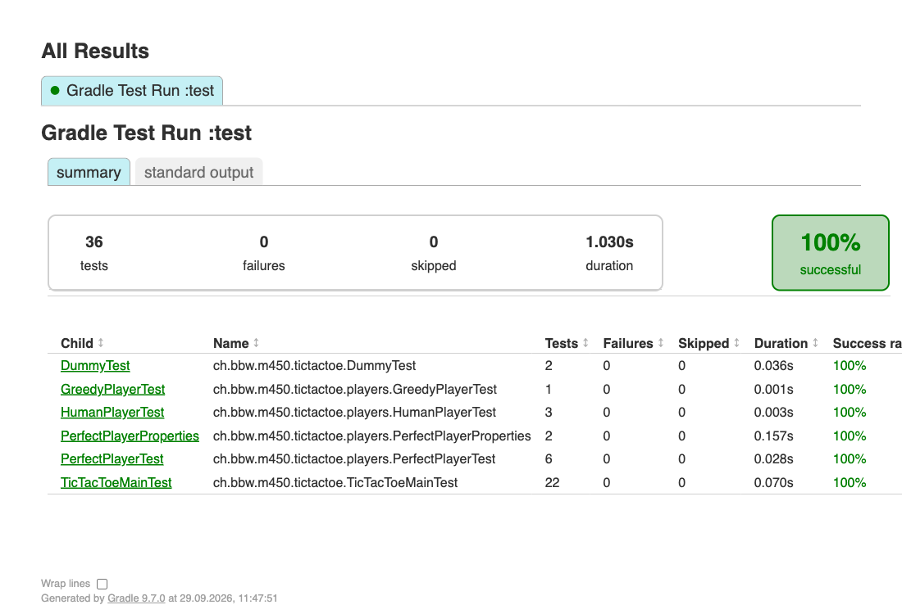
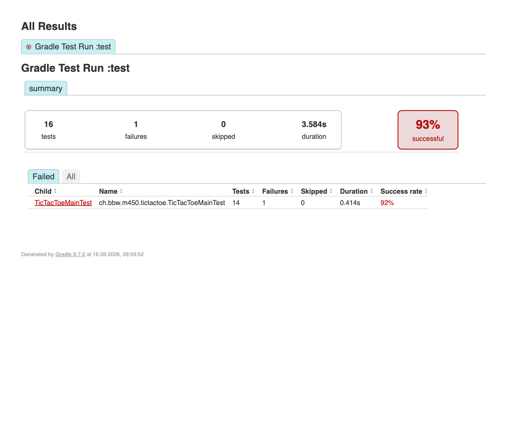
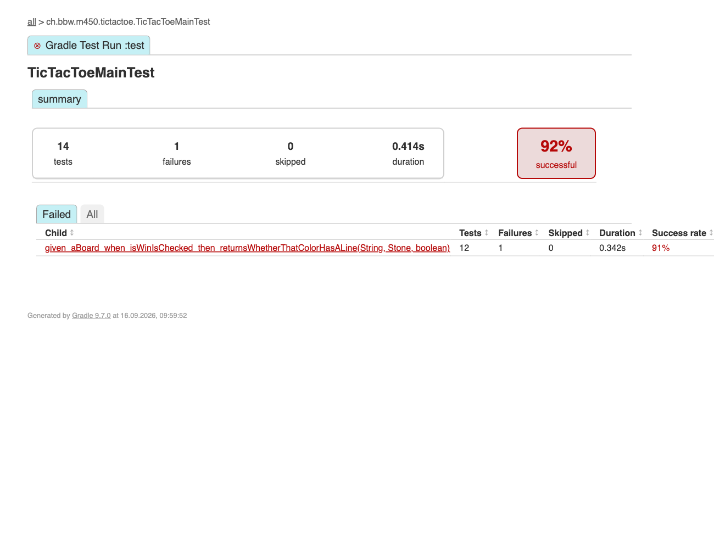
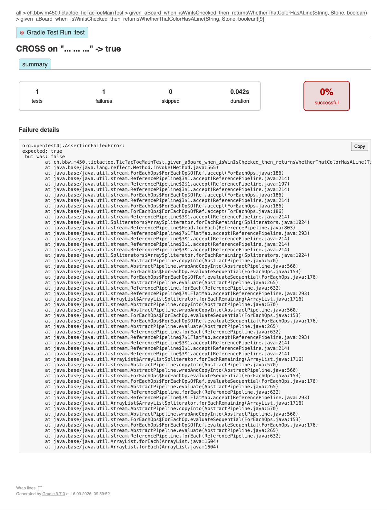

# Testkonzept – TicTacTest (Modul 450)

**Projekt:** TicTacTest (TicTacToe-Spiel-Engine in Java)
**Dokument-Version:** 0.3 (IST)
**Autor / Rolle:** Duarte Santos – Entwickler = Tester (bewertete Einzelarbeit)
**Repository:** `DuarteSantos8/450-tictactest-mvk`

Dieses Dokument beschreibt den **aktuellen IST-Zustand** der Test-Suite: was getestet wird,
mit welchen Werkzeugen, nach welcher Strategie und mit welchen Erfolgskriterien. Es
dokumentiert nur die bereits umgesetzten Tests, keine geplanten Erweiterungen.

## 1. Einleitung

Getestet wird das ganze Spiel: die Spiel-Engine `TicTacToeMain` und alle Player.

- **`isWin(Stone[] board, Stone color)`** – Sieg-Erkennung: hat eine Farbe drei in einer
  Linie? Eine reine Funktion über ein beliebiges Brett und Herzstück der Test-Suite.
- **`play(TicTacToePlayer xPlayer, TicTacToePlayer oPlayer)`** – der Spielablauf: eine
  komplette Partie, Sieg, Unentschieden, ungültige Züge und die Vorbedingung, dass beide
  Spieler verschieden sein müssen.
- **`toString(...)`** und **`main(...)`** – Bildschirmausgabe und Programmstart.
- **`HumanPlayer`** (liest von der Tastatur), **`GreedyPlayer`** und der neue, perfekt
  spielende **`PerfectPlayer`** (Minimax-Algorithmus).

## 2. Testziele

Die Ziele sind nummeriert, damit die Testfälle (Abschnitt 7) darauf verweisen können.

- **TZ-01:** `isWin` erkennt alle acht möglichen Siegeslinien für die richtige Farbe.
- **TZ-02:** `isWin` meldet für Bretter ohne Linie (oder für die falsche Farbe) korrekt „kein Sieg".
- **TZ-03:** `play` spielt eine vollständige Partie zweier `GreedyPlayer`; der Startspieler X gewinnt.
- **TZ-04:** `play` weist zwei identische Spieler-Instanzen mit einer `IllegalArgumentException` ab.
- **TZ-05:** `play` erkennt ein Unentschieden und bricht bei ungültigen Zügen mit einer
  `IllegalStateException` ab.
- **TZ-06:** Ein-/Ausgabe funktioniert: `HumanPlayer` liest die Eingabe, `toString` und `main`
  geben das Brett richtig aus (StdIn/StdOut-Tests mit Pioneer).
- **TZ-07:** Der `PerfectPlayer` verliert nie und blockt, wenn der Gegner gewinnen könnte.
- **TZ-08:** Mindestens 90 % Branch-Coverage (wird im Build erzwungen).

## 3. Teststrategie und Teststufen

**Teststufe:** automatisierte **Unit-Tests** (JUnit + AssertJ). Dazu kommen:

- **StdIn/StdOut-Tests mit Pioneer:** `@StdIo` ersetzt die Tastatur-Eingabe und fängt die
  Konsolen-Ausgabe ab (`HumanPlayerTest`, `main` und `play` in `TicTacToeMainTest`).
- **Property-based Tests mit jqwik** (zusätzliches Testframework): jqwik erzeugt viele
  zufällige Eingaben und prüft, dass eine Regel immer stimmt (`PerfectPlayerProperties`).
- **Mutation Testing mit PITest:** PITest baut absichtlich Fehler in den Code ein (z.B. `<`
  statt `<=`) und schaut, ob ein Test rot wird. Wird kein Test rot, ist der Test zu schwach.
- **Coverage-Verification mit JaCoCo:** der Build schlägt fehl, wenn die Branch-Coverage
  unter 90 % fällt.

Angewendete Prinzipien:

- **Given-When-Then** als Namens- und Aufbauschema: der Methodenname nennt Ausgangslage,
  Aktion und Erwartung; im Rumpf sind die drei Blöcke durch Leerzeilen getrennt.
- **AssertJ fluent-Assertions** statt roher `assertTrue(...)`: die Testklasse implementiert
  `WithAssertions`, damit `assertThat(...)` und `assertThatThrownBy(...)` direkt verfügbar sind.
- **Fixtures für Isolation:** benannte Board-Konstanten statt magischer Strings und vor jeder
  Testmethode frische Spieler-Instanzen (`@BeforeEach`).
- **Parameterized Test gegen Coderepetition:** die acht Siegeslinien und die Nicht-Sieg-Fälle
  laufen über *eine* Methode statt über je einen Test pro Brett.

### Fixtures und Helper

**Board-Fixtures** – benannte Konstanten. Ein Brett wird als Muster geschrieben, `X` = Kreuz,
`O` = Kreis, `.` = leeres Feld; die Leerzeichen trennen nur die drei Zeilen:

```java
private static final String DIAGONAL_X_WINS = "XOO OX. XOX";
private static final String DRAW_BOARD = "XOX XXO OXO";
```

**Spieler-Fixture** – `@BeforeEach setUp()` legt vor *jeder* Testmethode zwei frische
`GreedyPlayer` an, damit kein Test von einer Partie eines anderen Tests beeinflusst wird.

**Helper** – `Boards.toBoard(...)` übersetzt so ein Muster in das `Stone[]` mit neun Feldern,
das das Spiel erwartet. Er liegt in einer eigenen Klasse, damit alle Testklassen ihn benutzen
können (keine Coderepetition). Bei falscher Länge oder unbekanntem Zeichen wirft er eine
`IllegalArgumentException`.

**Test-Player als Lambda** – `TicTacToePlayer` hat nur eine Methode, darum kann man einen
Test-Player einfach als Lambda schreiben, z.B. einen „schummelnden“ Player, der immer auf
Feld `-1` spielt. So braucht es kein Mocking-Framework.

### Parameterized Test

Die Sieg-Erkennung (TZ-01 / TZ-02) wird mit *einer* Methode über viele Konstellationen geprüft:

```java
@ParameterizedTest(name = "{1} on \"{0}\" -> {2}")
@MethodSource("boardConstellations")
void given_aBoard_when_isWinIsChecked_then_returnsWhetherThatColorHasALine(String pattern, Stone color,
        boolean expectedToWin) {
    var board = toBoard(pattern);

    var winning = TicTacToeMain.isWin(board, color);

    assertThat(winning).isEqualTo(expectedToWin);
}
```

## 4. Testobjekte und Testabdeckung

| Testobjekt | Abgedeckt? | Testklasse | Bemerkung |
|---|---|---|---|
| `TicTacToeMain.isWin(...)` | ja | `TicTacToeMainTest` | alle acht Siegeslinien + Nicht-Sieg-Fälle |
| `TicTacToeMain.play(...)` | ja | `TicTacToeMainTest` | Sieg, Unentschieden, ungültige Züge, gleiche Spieler |
| `TicTacToeMain.toString(...)` | ja | `TicTacToeMainTest` | Ausgabe ohne Farbcodes verglichen |
| `TicTacToeMain.main(...)` | ja | `TicTacToeMainTest` | mit Pioneer: Eingabe `3, 4, 5` → Mensch gewinnt |
| `HumanPlayer` | ja | `HumanPlayerTest` | mit Pioneer: Eingabe lesen, Ausgabe prüfen, falsche Eingabe |
| `GreedyPlayer` | ja | `GreedyPlayerTest` | volles Brett → Exception; sonst über `play(...)` |
| `PerfectPlayer` | ja | `PerfectPlayerTest`, `PerfectPlayerProperties` | gewinnt gegen Greedy, blockt, verliert nie (jqwik) |
| `Stone.opponent()` | ja | `TicTacToeMainTest` | beide Farben |

**Gemessene Abdeckung (JaCoCo):**

| Metrik | Wert | Ziel |
|---|---|---|
| Branch-Coverage | **100 %** (94 von 94) | min. 90 % (im Build erzwungen) |
| Line-Coverage | **98.5 %** (67 von 68) | – |
| Mutation Score (PITest) | **99 %** (72 von 73 Mutanten gekillt) | – |

Die eine nicht abgedeckte Zeile ist der unsichtbare Standard-Konstruktor von `TicTacToeMain`
(die Klasse hat nur statische Methoden, darum wird nie ein Objekt davon erstellt).

Der eine überlebende Mutant ändert im `PerfectPlayer` `score > bestScore` zu `score >= bestScore`.
Dann nimmt der Player bei gleich guten Zügen den letzten statt den ersten – er spielt aber
genauso perfekt. Das ist ein **äquivalenter Mutant**, den kein Test erkennen kann.

## 5. Testrahmen und Erfolgskriterien

- **Wer testet:** der Entwickler selbst (Einzelarbeit).
- **Wann wird getestet:** lokal bei jeder Änderung und automatisch bei jedem Push und Pull-Request
  über GitHub Actions.
- **Pass-Kriterium:** alle Tests laufen grün durch (`0 failures, 0 errors`) und die
  Branch-Coverage ist mindestens 90 %.
- **Fail-Kriterium / Abbruchbedingung:** ein einziger roter Test oder zu wenig Coverage lässt
  die CI-Pipeline fehlschlagen; ein Pull-Request wird erst nach grünem Build gemergt.

## 6. Testumgebung und Testinfrastruktur

- **Sprache / Runtime:** Java 25 (Azul Zulu, bereitgestellt über den DevContainer).
- **Build-Tool:** Gradle 9.7 (über den `./gradlew`-Wrapper).
- **Testframeworks (aktuellste Versionen):** JUnit 6.1.3 (`junit-bom`), AssertJ 3.27.7,
  JUnit Pioneer 2.3.0, jqwik 1.10.1, JaCoCo 0.8.15, PITest 1.30.0.
- **Lokale Ausführung:**
  - `./gradlew test` → Test-Report unter `build/reports/tests/test/index.html`,
    Coverage-Report unter `build/reports/jacoco/test/html/index.html`
  - `./gradlew check` → zusätzlich die Coverage-Verification (min. 90 % Branch)
  - `./gradlew pitest` → Mutation-Report unter `build/reports/pitest/index.html`
- **CI:** `.github/workflows/build.yml` (Schritte `build` und `test`, im DevContainer-Image).
  Der Test-Job führt `./gradlew check pitest` aus und speichert Test-, Coverage- und
  PITest-Report bei jedem Commit als Artifacts.
- Der Parameterized Test braucht keine Zusatz-Abhängigkeit: `org.junit.jupiter:junit-jupiter`
  ist ein Sammel-Artefakt und enthält `junit-jupiter-params` bereits.

## 7. Testfallbeschreibungen

| ID | Zielbezug | Voraussetzung | Schritt | Erwartetes Ergebnis |
|---|---|---|---|---|
| TC-01 | TZ-01 | Brett `XXX ... ...` | `isWin(board, CROSS)` | `true` (oberste Reihe) |
| TC-02 | TZ-01 | Brett `..O ..O ..O` | `isWin(board, CIRCLE)` | `true` (rechte Spalte) |
| TC-03 | TZ-01 | Brett `XOO OX. XOX` | `isWin(board, CROSS)` | `true` (Diagonale 0-4-8) |
| TC-04 | TZ-02 | leeres Brett `... ... ...` | `isWin(board, CROSS)` | `false` |
| TC-05 | TZ-02 | Brett `OOO XX. .X.` | `isWin(board, CROSS)` | `false` (Linie gehört O, nicht X) |
| TC-06 | TZ-03 | zwei frische `GreedyPlayer` | `play(xPlayer, oPlayer)` | Rückgabe `CROSS` (X gewinnt) |
| TC-07 | TZ-04 | dieselbe Spieler-Instanz als X und O | `play(xPlayer, xPlayer)` | `IllegalArgumentException` |
| TC-08 | TZ-05 | zwei `PerfectPlayer` | `play(...)` | Rückgabe `null`, Ausgabe „it's a draw!“ |
| TC-09 | TZ-05 | O spielt auf `-1`, `9` oder das besetzte Feld `0` | `play(greedy, cheater)` | `IllegalStateException` |
| TC-10 | TZ-06 | Eingabe `" 4 "` | `HumanPlayer.play(...)` | Rückgabe `4`, Frage „where to to put…“ wird ausgegeben |
| TC-11 | TZ-06 | Eingabe `abc` | `HumanPlayer.play(...)` | `NumberFormatException` |
| TC-12 | TZ-06 | Brett `X.. .O. ...` | `toString(board)` | `X  1  2` / `3  O  5` / `6  7  8` |
| TC-13 | TZ-06 | Eingabe `3, 4, 5` | `main(...)` | Ausgabe „...and the winner is: CROSS“ |
| TC-14 | TZ-07 | `GreedyPlayer` gegen `PerfectPlayer` (beide Reihenfolgen) | `play(...)` | `PerfectPlayer` gewinnt |
| TC-15 | TZ-07 | Brett `XX. .O. ...`, O ist dran | `PerfectPlayer.play(...)` | `2` (blockt) |
| TC-16 | TZ-07 | zufälliger Gegner (50 Spiele, jqwik) | `play(random, perfect)` | der Zufalls-Player gewinnt nie |
| TC-17 | TZ-08 | – | `./gradlew check` | Build grün, Branch-Coverage ≥ 90 % |

TC-01 bis TC-05 sind Beispiele aus den 12 Konstellationen des Parameterized Tests
(`boardConstellations`); die vollständige Liste steht in `TicTacToeMainTest.java`.

## 8. Testplan und Zuständigkeiten

- **Zuständig:** Duarte Santos (Erstellung, Ausführung und Wartung der Tests).
- **Ausführung:** automatisiert bei jedem Push / Pull-Request über GitHub Actions; zusätzlich
  lokal vor jedem Commit.
- **Ergebnisdokumentation:** Test-Report und JaCoCo-Coverage werden in der CI als Artifact
  gespeichert; die Coverage-Entwicklung ist als Time-Series auf GitHub Pages sichtbar.

## 9. Dummy-Tests

Datei: [`DummyTest.java`](../src/test/java/ch/bbw/m450/tictactoe/DummyTest.java) – rein
technischer Nachweis, dass JUnit 5 und AssertJ korrekt eingebunden sind (keine TicTacToe-Logik,
je einmal JUnit `assertEquals` und AssertJ `assertThat` nebeneinander).

## 10. Testumfang

**Gesamt: 36 Tests**, zuletzt lokal mit `./gradlew check pitest` ausgeführt: **36 Tests, 0 Fehler**.

| Testklasse | Anzahl | Inhalt |
|---|---|---|
| `DummyTest` | 2 | Nachweis JUnit + AssertJ |
| `TicTacToeMainTest` | 22 | 12 × Parameterized `isWin`, 3 × ungültiger Zug, 7 Einzeltests |
| `HumanPlayerTest` | 3 | StdIn/StdOut mit Pioneer |
| `GreedyPlayerTest` | 1 | volles Brett |
| `PerfectPlayerTest` | 6 | 2 Spiele gegen Greedy, 3 × blocken, volles Brett |
| `PerfectPlayerProperties` | 2 | jqwik-Properties (je 50 zufällige Durchläufe) |

Bei jedem Push/Pull-Request läuft zusätzlich die GitHub-Actions-Pipeline; der Build ist grün.

## 11. Screenshots

Alle Tests erfolgreich (36/36):



Ein bewusst fehlgeschlagener Test (zum Nachweis; danach wieder zurückgesetzt) – Übersicht,
Klassendetail und Stacktrace:






